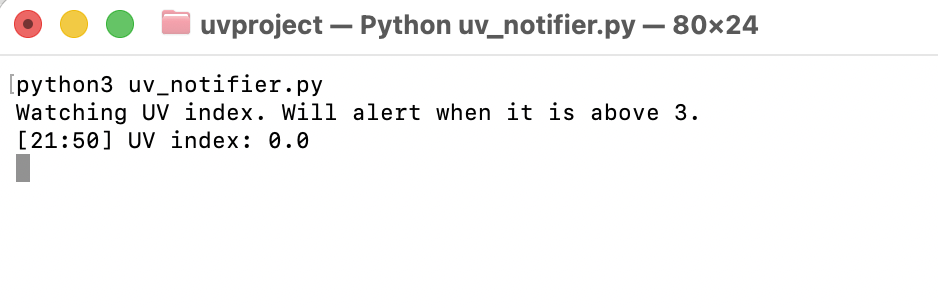

# UV Index Notifier

A Python script that checks the current UV index every 30 minutes and sends a notification when it goes above 3, so you know when to put on sunscreen. It uses the free Open-Meteo API (no account or API key needed) and can alert you on your desktop or your phone.

## Screenshot



## Requirements

- Python 3.8 or newer
- The `requests` and `plyer` libraries

## Installation

1. Download or clone this repository:
```
   git clone https://github.com/kezibanmu/uv-index-notifier.git
   cd uv-index-notifier
```
2. Install the dependencies:
```
   pip install -r requirements.txt
```

## Usage

Run the script and leave the terminal window open:

```
python uv_notifier.py
```

(On Mac or Linux you may need to use `python3` and `pip3` instead.)

The script prints the UV index every 30 minutes. When it rises above the threshold you get a notification, and if it stays high you get a sunscreen reapply reminder every 2 hours. Press `Ctrl + C` to stop it.

## Configuration

All settings are at the top of `uv_notifier.py`:

| Setting | What it does | Default |
|---|---|---|
| `LATITUDE`, `LONGITUDE` | Your location | 36.62, 29.11 (Fethiye) |
| `UV_THRESHOLD` | Notify when UV is above this value | 3 |
| `CHECK_EVERY_MINUTES` | How often to check | 30 |
| `REMIND_EVERY_HOURS` | How often to repeat the reminder while UV is high | 2 |
| `NTFY_TOPIC` | Optional topic name for phone notifications | empty |

**Changing your location:** find your city's coordinates (search "your city coordinates" or use Google Maps by right-clicking a spot) and replace `LATITUDE` and `LONGITUDE`.

**Changing the threshold:** change `UV_THRESHOLD = 3` to any number you like. For example, `UV_THRESHOLD = 5` only alerts you at higher UV levels.

## Phone notifications (optional)

1. Install the free [ntfy](https://ntfy.sh) app on your phone.
2. Subscribe to a topic name that is hard to guess, for example `my-uv-alerts-8391`.
3. Put the same name in `NTFY_TOPIC` in `uv_notifier.py`.

Note: the script must be running on a computer that is turned on. It sends alerts to your phone, but it does not run on the phone itself.

## How it works

The script sends a request to the [Open-Meteo API](https://open-meteo.com/) for the current UV index at your coordinates, compares it to your threshold, and sends a notification when it crosses above it. It only alerts when the level changes (or on a timed reminder), so it won't spam you at every check.

## Future ideas

- Run automatically on a schedule in the cloud (GitHub Actions)
- Only check during daytime hours
- Log UV values to a CSV and chart them
- Command-line arguments for threshold and location

## License

MIT
